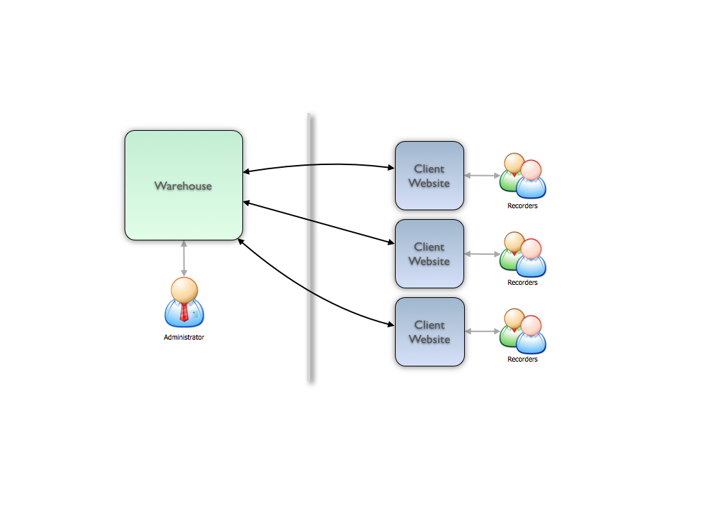
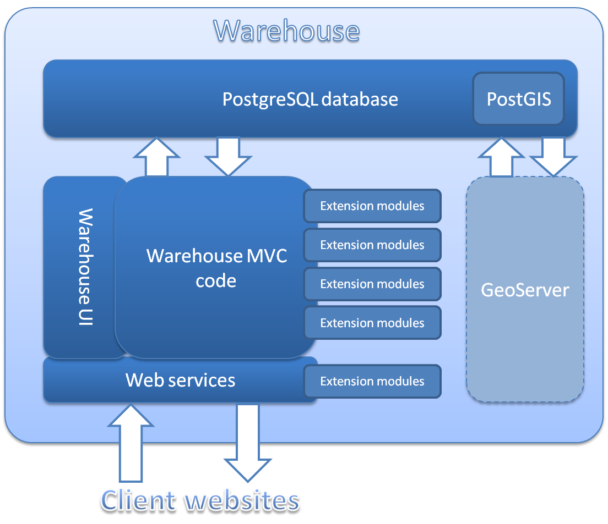

Architecture Overview
=====================

If you need a brief introduction to the technical architecture of Indicia, then 
read on. 

Indicia consists of 2 main components:

* The warehouse
* The client website

The warehouse consists of the database itself and administration tools as well 
as a set of web-services which allow the client website to communicate with it. 
The client website is the part which hosts the online recording, reporting and 
other pages which the end-user sees. The division into two components serves to 
keep the administration interfaces and the end-user interfaces completely 
separate. Also, a fully featured online recording solution makes heavy demands 
on the server technology, in particular to allow it to properly support spatial 
data. Therefore this separation allows a single warehouse to be shared between 
multiple client websites. As long as partner can be found able to host a 
website, this means that the server technology required to run online recording 
on a client website is minimal and indeed, most cheap web hosting services will 
support Indicia based online recording. 

Warehouse architecture
^^^^^^^^^^^^^^^^^^^^^^

The following diagram illustrates the basic architecture of the warehouse.

  
There are quite a few acronyms and other bits of jargon but don't worry, we'll 
work through each of these in turn. 

.. todo:: 

  Check heading for sub-sub-sections below.

PostgreSQL
""""""""""

PostgreSQL is a relational database management system. In essence, a relational 
database is a collection of tables of data, each of which may relate to rows 
(records) in other tables in the database by the use of unique identifiers. 
PostgreSQL is just one of many pieces of software that are designed to manage 
relational databases, letting you store and extract the data in powerful and 
flexible ways. Each makes claim and counter-claim regarding which is the 
fastest, which can hold the most data and so forth. Our choice of PostgreSQL is 
based on:

* It has a free and open source community edition which we use for Indicia
* It is at least similar in performance, flexibility and power to the other, 
  proprietary commercial offerings
* When combined with PostGIS, it has better support for spatial data than most 
  alternatives, that is, data which have geographic information attached to 
  them. The most commonly used database for website development, MySQL, is 
  rather poor in its support for spatial querying in comparison. We'll find out 
  more information about PostGIS in a moment.
* It is actively being developed and continually improving.

PostGIS
"""""""

PostGIS adds support for geographical information to PostgreSQL. A database that
supports geographic data is often called "spatially enabled". Not only can 
PostgreSQL + PostGIS store map data directly in the database, but PostGIS adds
a whole plethora of functions for transforming between different 
cartographic projections, measuring, manipulating and otherwise interpreting
the geographic objects it stores. For example, PostGIS can:

* convert the boundary of a place from a latitude and longitude map projection
  to British National Grid projection,
* find all the records within 200m of a river,
* let you report on the data in a user-drawn polygon which can optionally be 
  buffered.

Warehouse MVC code
""""""""""""""""""

.. warning::

  Jargon alert!

  The code for the warehouse is written in PHP and uses a framework called 
  `Kohana <http://kohanaframework.org/>`_. Kohana is one of a number of 
  frameworks that use the `Model View Controller <http://en.wikipedia.org/wiki/Model–view–controller>`_ 
  (MVC) design pattern available for PHP. By using a framework rather than 
  starting from scratch we get a collection of useful code for accessing the 
  database, building the user interface and business logic. As an MVC framework, 
  Kohana also provides a standard way to organise code classes into logically
  separate roles:

  * Models - classes which interact with the database. Each model class normally
    represents a single object in the database and provides methods to insert,
    delete and modify records as well as properties to inspect field values from
    the database.
  * Views - code which provides the user interface. In our case these are PHP
    files which output HTML. 
  * Controllers - classes which manage the business logic and interactions 
    between models and views.

Kohana's framework allows for additional modules which can extend existing
functionality and provide new functionality. 

Indicia's warehouse code adds lots of useful code to Kohana including
helper classes for handling different grid reference notations, managing vague
dates and a host of other online-recording tasks. In addition the extensibility
of Kohana is augmented to provide a simple way to add new data tables, screens,
and tabs to the existing warehouse user interface.

.. note: 

  This ability to extend the data model was used by the Wildfowl and Wetlands
  Trust to develop a module which provides support for recording individuals, 
  flocks, family relationships and identifying marks such as rings in birds.

Warehouse UI
""""""""""""

The warehouse user interface code consists of a series of Kohana views. 

.. todo:: 

  mention the separation between earlier kohana code and later code which uses
  the client helpers.

Web services
""""""""""""

Extension modules
"""""""""""""""""

GeoServer
"""""""""