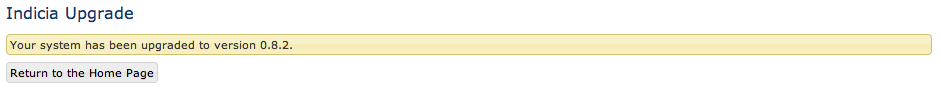

Tutorial: Adding a new attribute to the Indicia core
====================================================

Indicia takes the approach of only including attributes in the core data model 
if they are likely to be of use to most surveys, as the core data model should 
be kept as lightweight and efficient as possible. All other attributes are 
handled by adding custom attributes you the survey. On occasion though you might 
decide that a particular attribute would be of benefit to other if it existed in 
the core code. We'll work through an example enhancement - extending the Taxon 
Group entity to support a link to a website, so that each taxon group can either 
have no website associated with it and therefore be available to all, or can 
have a website associated with it so that the taxon group is only available to 
that website. Currently all taxon groups are global so this might well be a 
useful enhancement. 

Database scripts
----------------

First things first, we need to add a field to the taxon_groups database table to 
link to the website. You can write the script by hand, or use pgAdmin to create 
the objects then select them in the database object hierarchy on the left and 
copy the script that is displayed in the panel in the bottom right. The purposes 
of this section are not to teach writing SQL so for now we will go with the 
following script I've generated using pgAdmin, which: 

* Adds a website_id integer field to the taxon_groups table.
* Adds a comment to the new field to describe its purpose.
* Creates a foreign key relationship to the websites table.

.. code-block:: sql

  -- Column: website_id

  -- ALTER TABLE indicia.taxon_groups DROP COLUMN website_id;

  ALTER TABLE indicia.taxon_groups ADD COLUMN website_id integer;
  COMMENT ON COLUMN indicia.taxon_groups.website_id 
    IS 'Identifies the website that owns this taxon group, if any. Foreign key to the websites table.';

  -- Foreign Key: indicia.fk_taxon_groups_websites

  -- ALTER TABLE indicia.taxon_groups DROP CONSTRAINT fk_taxon_groups_websites;

  ALTER TABLE indicia.taxon_groups
    ADD CONSTRAINT fk_taxon_groups_websites FOREIGN KEY (website_id)
        REFERENCES indicia.websites (id) MATCH SIMPLE
        ON UPDATE NO ACTION ON DELETE NO ACTION;

Before this script can be used by Indicia, there are a few things we should do 
to clean it up. Firstly, the 2 comments relating to DROPping objects are not 
really necessary so in the interests of reducing clutter we'll discard them. 
More importantly though, pgAdmin has prefixed all the database object names with 
the **schema** name that the database objects exist in, in my case this is 
*indicia* and we must remove these references. 

.. warning::

  PostgreSQL includes a very handy way of partitioning the objects in a database 
  up into different themed groups, called **schemas**. When installing the 
  warehouse you select the name of the schema to create objects against and 
  although this defaults to indicia, this can be overridden with a different 
  name if preferred. Scripts auto-generated by pgAdmin will always specify the 
  name of the database schema that objects are created within, therefore the 
  *scripts generated by pgAdmin may break when run against some warehouses 
  because the schema name is wrong*. The solution is simple - just remove the 
  schema name and the following full-stop from throughout any scripts; when the 
  warehouse uses the script to upgrade it does so with the correct schema 
  (normally called indicia) selected as default so that the objects are created 
  on the correct schema.
  
  If you forget to remove the schema name, then the script will appear to be OK
  on your machine when you test it because the schema name in the script will 
  match yours. *When run on another machine with a different schema name the 
  script will fail because of the missing schema.*

Having applied these two considerations we end up with the following tidied 
version of the script:

.. code-block:: sql

  -- Column: website_id

  ALTER TABLE taxon_groups ADD COLUMN website_id integer;
  COMMENT ON COLUMN taxon_groups.website_id IS 'Identifies the website that owns this taxon group, if any. Foreign key to the websites table.';

  -- Foreign Key: fk_taxon_groups_websites

  ALTER TABLE taxon_groups
    ADD CONSTRAINT fk_taxon_groups_websites FOREIGN KEY (website_id)
        REFERENCES websites (id) MATCH SIMPLE
        ON UPDATE NO ACTION ON DELETE NO ACTION;

Now we must save the script in the correct place so that the warehouse's upgrade 
code can find it. Since this is a change to the warehouse core, we need to save 
the script into the indicia_setup module's db folder. Browse to 
modules\indicia_setup\db within your warehouse's file folder. You will find a 
folder for each version of Indicia containing the upgrade scripts currently 
available for that version, each named version_x_x_x. Unless you have good 
reason to do otherwise, always select folder with the highest version number to 
save your script in. So, create a text file containing the above script then 
open the appropriate folder and save your script with the following file name 
format:: 

  yyyymmddhhmm_description.sql
  
You are creating a file named with the 4 digit year, 2 digit month, 2 digit day, 
2 digit hour and 2 digit minute of the current time, followed by a brief 
descriptive word or phrase relating to the script, typically relating to the 
affected object names. For example, this might be along the lines of 
*201210150921_taxon_groups_website.sql*. 

Personally, once I have created a database script in this way I like to use 
pgAdmin to remove any objects that I created during the script writing process, 
then use the warehouse upgrader to run the script which ensures that it runs 
correctly and that the objects all have the correct permissions and ownership. 
In your case you won't have created any objects during script writing, so you 
can simply log into your warehouse if you are not already logged in and visit 
the `index.php/home/upgrade` path to force the upgrade process to run the 
script. You should see a message displayed as follows: 

.. tip::
  
  Find out about the `Kohana naming conventions <http://docs.kohanaphp.com/libraries/orm/starting#orm_conventions>`_ 
  you should use when creating objects in the data model.

Model code
----------

Next we need to write the PHP which makes the Indicia warehouse aware of the new 
field in the database. Remember that Indicia, being based on `Kohana 
<http://kohanaframework.org>`_, uses a variant of Model View Controller 
architecture. This means that in most cases any enhancements which extend the 
data model in any way will always require changes to the model to build the link 
between the warehouse and the database, the view which builds the user interface 
and the controller which glues it all together. First, we need to ensure that 
the model code is aware of our new field. Using your text editor, open the file 
application/models/taxon_group.php. You will find that it declares a class which 
extends the **ORM** class. But look very carefully - the class does not declare 
any properties or similar code to allow access to the underlying database table 
field values. Yet we know that the class supports code such as: 

.. code-block:: php

  <?php
  // Use Kohana's ORM class' factory function to create an instance of the taxon group model 
  // and point it to existing record ID 1.
  $obj = ORM::factory('taxon_group', 1);
  // Change the title
  $obj->title='I changed the title';
  // save it into the database
  $obj->save();
  ?>
 
.. note::

  ORM, or Object Relational Mapping, refers to the writing of a database access 
  layer using one class per database entity where instances of the class are 
  associated with single records in the database. Each class has methods to 
  insert, delete or edit records as well as properties providing access to 
  record's field values and the related records via foreign keys. One of the 
  great things that the Kohana framework gives us is an implementation of ORM 
  which requires minimal code to set up new entity classes as it inspects the 
  database schema to find the database fields it must expose via the class. 
  That's why we don't actually need to write any code for the taxon_group class 
  to support access to the title database field, or indeed our new website_id 
  database field. 

Although the ORM framework code does most of what is needed for our new 
website_id field automatically, there are 2 reasons why you will want to add 
code to the model class. 

* when there are validation rules required for the field
* when the field is a foreign key to another table

In our case, there are no validation rules required as the field is a simple, 
non-mandatory foreign key. In this case we must still make a small change to the 
``validate`` method in the model class code. Search for the declaration of the 
``$unvalidated_fields`` variable and modify it to add website_id to the array 
list. This makes Indicia's database saving code aware of the presence of the 
field. The new declaration of this variable should look like: 

.. code-block:: php

  <?php
  $this->unvalidatedFields = array('deleted','website_id');
  ?>

We are adding a foreign key so need to know how to handle this. The ORM class 
has a number of variables which can describe how this entity relates to other 
entities in the data model. Looking at the existing taxon_group class we can see 
the following code: 

.. code-block:: php

  <?php
  protected $has_many = array('taxa');

  protected $belongs_to = array(
    'created_by'=>'user',
    'updated_by'=>'user'
  );
  ?>

This simply puts the following descriptive sentences into a programmatic form 
which the ORM framework class can put to good use: 

* One taxon group has many taxa.
* One taxon group belongs to a user (via the created_by field)
* One taxon group belongs to a user (via the updated_by field)

As a result of this, having instantiated a taxon group model, that we can do 
things such as 

.. code-block:: php

  <?php
  echo ' The user who created this taxon group was '.$obj->created_by->username;
  echo ' The taxon group includes: ';
  foreach ($obj->taxa as $taxon)
    echo " ".$taxon->taxon;  
  ?>
  
You can even daisy chain these relationships between ORM classes to "wander 
round" the model, for example: 

.. code-block:: php

  <?php
  $person=$obj->created_by->person->created_by->person;
  echo ' The person who created the person who created this taxon group was '.$person->first_name.' '.$person->surname;
  ?>
  
This code is of course fairly ridiculous and because ORM will have to issue a 
new query to the database for each "hop" along the chain it is not very 
efficient. 

.. tip::

  If you find yourself chaining hops around database tables in your ORM code in 
  this way, then you need to take a look at Kohana's `query builder 
  <http://docs.kohanaphp.com/libraries/database/builder>`_ for a more efficient 
  way of doing this as it allows you to build a query with multiple joins in a 
  database agnostic way. 
  
For the new website_id field, we are adding relationships which could be 
described by the following statements, the latter effectively being the same as
the former but from the opposite direction:

* A taxon group may belong to a website.
* A website has many taxon groups.

To declare the former, we need to edit the taxon group model code to add the 
website entity to the $belongs_to variable. We don't need to declare the foreign
key field name since we are using the default foreign key name according to the 
Kohana conventions, which is the singular form of the foreign entity name, 
followed by an underscore then an id, e.g. ``website_id``. Make the change to 
your copy of the taxon group model class as follows:

.. code-block:: php
  
  <?php
  protected $belongs_to = array(
    'created_by'=>'user',
    'updated_by'=>'user',
    'website'
  );
  ?>
  
We also need to declare the relationship from the other direction, so that the
website model is aware that it owns taxon groups. Open your copy of the 
application/models/website.php class and find the declaration of the 
``$has_many`` variable. Insert an extra entry into the array so that the website
model knows that it "has many taxon groups" noting that you must use the plural
form of the model name since this is a reference to many. 

Our websites model code declaring the ``$has_many`` variable should now look 
like:

.. code-block:: php

  <?php
  protected $has_many = array(
    'termlists',
    'taxon_lists',
    'taxon_groups'
  );
  ?>
  
See `defining relationships in ORM <http://docs.kohanaphp.com/libraries/orm/starting?s[]=has&s[]=many#defining_relationships_in_orm>`_
for more information on this topic.

View code
---------

.. topic:: Chickens and eggs

  When Indicia's development started, we needed a warehouse user interface right 
  from the outset so that we could see the results of the client-website 
  building code we were developing. So, although it made a lot of sense for the 
  warehouse to use the same PHP client helper classes that the online recording 
  websites we planned to build were going to use, this simply couldn't happen 
  because the classes were not written when the first parts of the warehouse 
  were written. That's why warehouse views often use the standard Kohana HTML 
  output classes and normal PHP code rather than the nice, shiny form building 
  code approach we've since developed. All new warehouse entities should be 
  written using Indicia's PHP client helpers though and we've ported some of the 
  existing views to the new coding methods when we've done any substantial work 
  on a view. 

Next we need to add a reference to our new attribute into the code for the view. 
Find the folder application/views/taxon_group in your warehouse file folder and 
look at the files. You will see there is a file called *index.php* which 
declares the view used to display the index of taxon groups, i.e. the list page 
you get which shows you a table of the available taxon groups. There is also a 
second view file called *taxon_group_edit.php* which obviously contains the code 
we want to edit. Open this in your text editor and have a look. You'll see code 
like the following:

.. code-block:: php

  
This page allows you to specify the details of a taxon group.

  <form class="cmxform" action="<?php echo url::site().'taxon_group/save'; ?>" method="post">
  <?php echo $metadata ?>
  <fieldset>
  <input type="hidden" name="taxon_group:id" value="<?php echo html::initial_value($values, 'taxon_group:id'); ?>" />
  <legend>Taxon Group details</legend>
  <ol>
  <li>
  <label for="title">Title</label>
  <input id="title" name="taxon_group:title" value="<?php echo html::initial_value($values, 'taxon_group:title'); ?>" />
  <?php echo html::error_message($model->getError('taxon_group:title')); ?>
  </li>
  <li>
  <label for="title">External key</label>
  <input id="title" name="taxon_group:external_key" value="<?php echo html::initial_value($values, 'taxon_group:external_key'); ?>" />
  <?php echo html::error_message($model->getError('taxon_group:external_key')); ?>
  </li>
  </ol>
  </fieldset>
  <?php 
  echo html::form_buttons(html::initial_value($values, 'taxon_group:id')!=null);
  ?>
  </form>  

There's no need to learn every intricacy of this code since it uses the style of coding we were forced to use in the warehouse before the client helper libraries were ready. So, paste the following code into your copy of the file, on a new line after the last `</li>` and before the closing `</ol>`:

.. code-block:: php

  <li>
  <label for="website_id">Website</label>
  <select id="website_id" name="taxon_group:website_id">
    <option value="">&lt;Please select&gt;</option>
  <?php
    if (!is_null($this->auth_filter))
      $websites = ORM::factory('website')->where(array('deleted'=>'f'))->in('id',$this->auth_filter['values'])->orderby('title','asc')->find_all();
    else
      $websites = ORM::factory('website')->where(array('deleted'=>'f'))->orderby('title','asc')->find_all();
    $selected = html::initial_value($values, 'taxon_group:website_id'); 
    foreach ($websites as $website) {
      echo '	<option value="'.$website->id.'" ';
      if ($website->id==$selected)
        echo 'selected="selected" ';
      echo '>'.$website->title.'</option>';
    }
  ?>
  </select>
  <?php echo html::error_message($model->getError('taxon_group:website_id')); ?>
  </li>
  
This code adds a new entry into the list of form inputs, wrapped in the `<li>..</li>` element. It outputs a label for the new control then creates an HTML select form control. This is populated with a list of the websites that the user is allowed to see and the current one loaded from the existing taxon_group record is selected. Now, save the file and load up the edit page for an existing taxon group in your warehouse. You should see that the website control has appeared on our view's output:

.. todo::

  image of the taxon group edit showing the new control

Controller code
---------------

Try selecting a website in the select box then saving the taxon group. Now, click the edit link in the grid again to reload it. You will find that the taxon group model has automatically saved and reloaded the selected website without writing any code. Of course, this does not mean you won't need to write controller code at all, just that the basic handling of field saving and loading is automatic. 

There is one thing we should do in the controller though, declare a permissions function which dictates to the warehouse whether the current logged-in user is able to view and edit a particular taxon group record. We don't want to let people view or edit groups belonging to websites that they are not at least editors for. To do this, add the following line of code to end of the **constructor** of the controller class as well as the additional **record_authorised** method to your ``Taxon_Group_Controller`` class. This makes use of the ``$auth_filter`` member data for an Indicia controller class which normally describes a list of website IDs the user has access to:

.. code-block:: php

  <?php
  class Taxon_Group_Controller extends Gridview_Base_Controller {
    
    public function __construct() {
      ...
      $this->set_website_access('editor');
    }
    
    ...
    
    /**
     * Check access to the edit page of a taxon group. Groups cannot be edited if not core admin, unless they are linked 
     * to your website(s) or are not linked to anything.
     */
    protected function record_authorised ($id)
    {
      if (!is_null($id) AND !is_null($this->auth_filter)) {
        $tg = ORM::factory('taxon_group', $id);
        return (in_array($tg->website_id, $this->auth_filter['values']));
      }
      return true;
    }

  }
  ?>
  
The call to ``set_website_access`` is required to tell the base class that an 
authorisation filter for websites should be created based on the user having 
either editor or admin rights to a website. The ``record_authorised`` method is
then responsible for applying the list of websites in the filter to the website
that the edited taxon group belongs to. 

Updating the index page grid
----------------------------

Although we have now completed the changes required to the taxon groups edit 
page, allowing us to view and edit our new attribute, we have not yet considered
the index page which lists the available groups. Sometimes it is not necessary 
to modify this page when a new attribute is created, but in this instance we 
will need to at the very least filter the list of groups to the websites that 
the logged in user has access to and we might also want to display the website 
as an extra column in the grid. The grids used for displaying lists of various 
data in the warehouse usually load their content from a database view, called 
gv_entity, replacing tablename with the singular name of the entity being 
listed. So, we need to modify *gv_taxon_groups* in order to add the extra column
to the output. Follow these steps to do this.

#. Find the gv_taxon_groups view in pgAdmin and select it. You'll find it under 
   the views folder within the indicia schema, assuming you are set up to use 
   this default schema name.
#. Copy the SQL for the view from the **SQL Pane** on the right to the clipboard 
   and paste it into a text editor.
#. As before, remove all references to the schema name. I simply search for 
   "indicia." and replace it with "".
#. Remove the ``ALTER TABLE`` statement at the bottom which sets the views 
   owner, since we don't know the username which should be given ownership on 
   other installations of the warehouse. When the upgrader runs our script it 
   will do so using the correct database user so that the owner will 
   automatically be correct anyway.
#. Add a join to the websites table to the query in the view's script. This 
   join should include a filter for `deleted=false` so that taxon groups for 
   deleted websites are excluded from the grid. Also, note that this join must 
   be a *LEFT OUTER* join (abbreviated as just LEFT JOIN) because the website_id 
   field is not mandatory.
#. Remove the existing null output column for the website_id since this is no 
   longer relevant. Add the website's id and title fields to the output columns 
   for the query and give them suitable aliases.
#. Uncomment the ``DROP VIEW`` statement as we are adding a new column to the 
   view's output which some earlier versions of PostgreSQL do not allow on an 
   existing view.
#. As before, save the script file using the correct dated filename format in 
   the correct versions script folder, then visit the warehouse's 
   index.php/home/upgrade path using your web browser to apply the script and 
   check it works.

If you want to cheat, here's the script for my version of the view now:

.. code-block:: sql

  -- View: gv_taxon_groups

  DROP VIEW gv_taxon_groups;

  CREATE OR REPLACE VIEW gv_taxon_groups AS 
   SELECT t.id, t.title, w.id AS website_id, w.title as website_title
     FROM taxon_groups t
     LEFT JOIN websites w on w.id=t.website_id AND w.deleted=false
    WHERE t.deleted = false;

To make this new column appear in the grid, we must return to the constructor of
the Taxon_Group_Controller class:

.. code-block:: php

  public function __construct() {
    parent::__construct('taxon_group');
    $this->columns = array(
      'title'=>'');
    $this->pagetitle = "Taxon Groups";
    $this->set_website_access('editor');
  }
  
Notice the declaration of the array of columns? This is a simple associative
array where each key is a fieldname in the view to output into the grid. The 
values provided give the column titles; in this case a blank value allows the
warehouse to auto-generate a default column title. So, update the code which
assigns the columns to look like the following, by adding our new website_title
field to the list.

.. code-block:: php

  $this->columns = array(
      'title'=>'',
      'website_title'=>''
  );
  
.. note::

  Because we have already setup the authorisation filter, Indicia will look for 
  the website ID column in our view and automatically filter the view to show
  only taxon groups where the website ID is null or where the logged in user
  has editor or admin access to the website.

Other changes
-------------

There are, of course, other changes we need to consider when adding attributes
to a database entity which go beyond the scope of this tutorial, such as 
updating the websites editor to provide a list of the taxon groups the website
owns, or updating the list_taxon_groups and detail_taxon_groups database views
with the new field. The view changes could be handled in a very similar way to 
our extension of the gv_taxon_groups view.