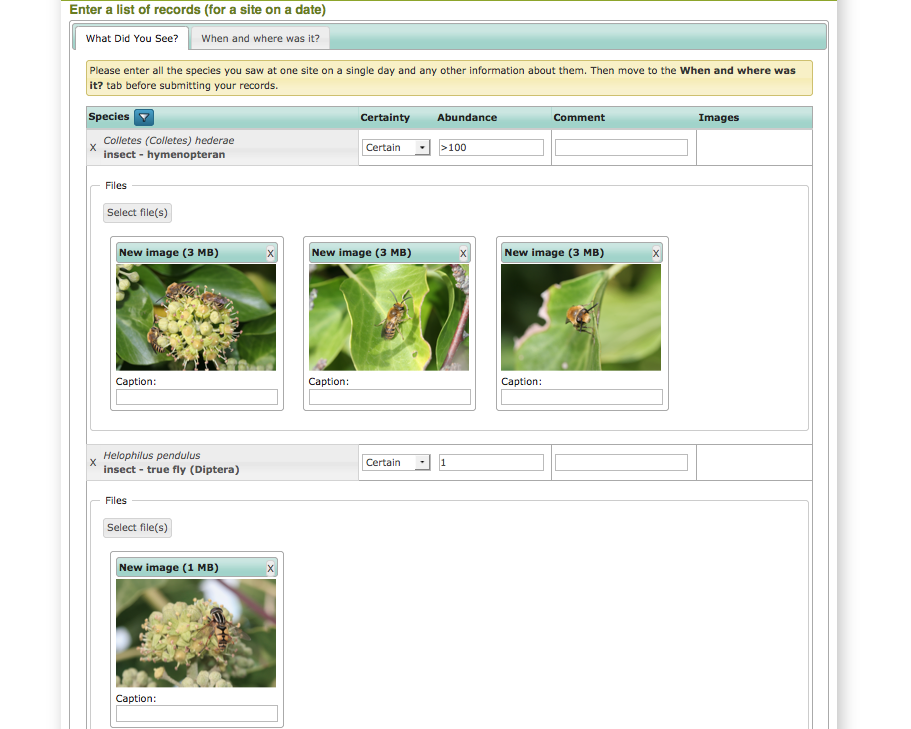
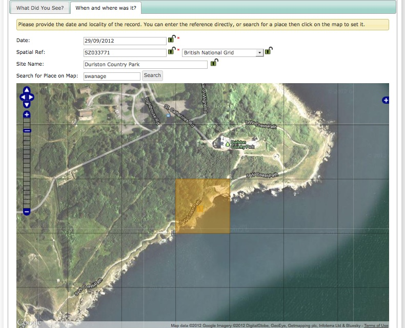
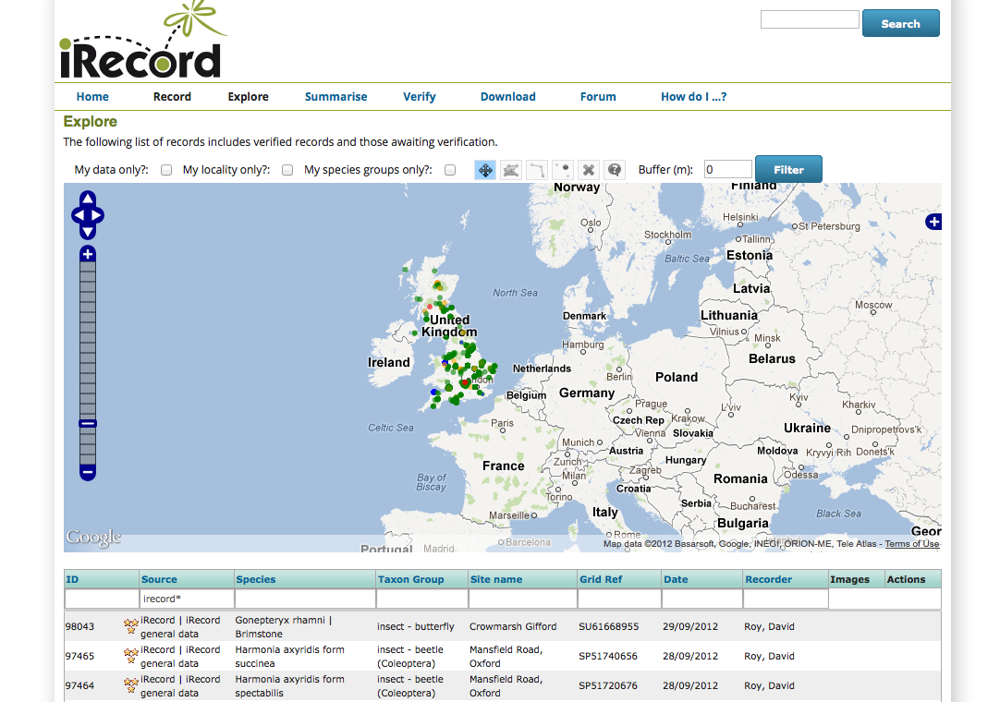
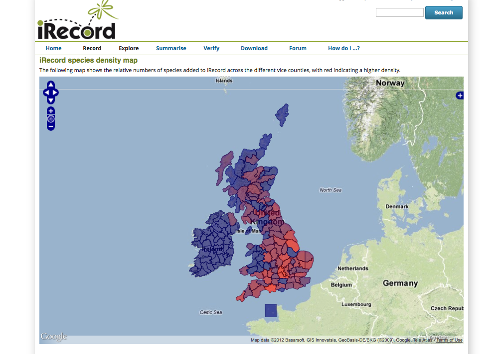
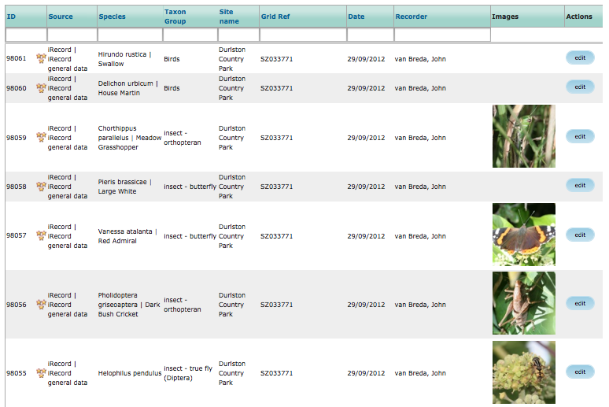
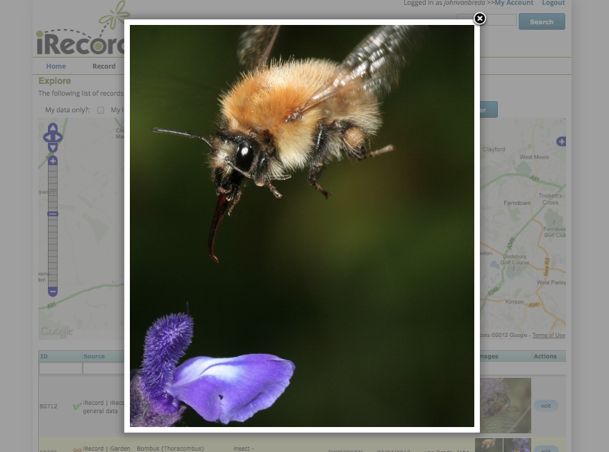
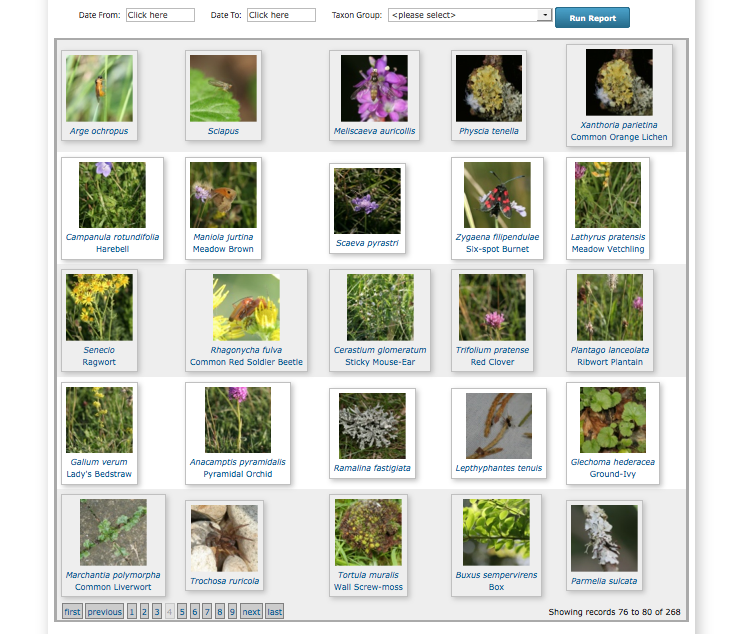

Screenshot Gallery
##################

Data entry
----------

Data entry in Indicia can be via any method that is appropriate to the survey, 
but in many cases the species checklist control can be configured to allow 
appropriate and rapid data entry that suits the survey's needs. Here the grid
is configured to allow basic record data plus the upload of photos for each 
record. The grid handles resizing of images from within the browser meaning that
photo upload times are drastically reduced.

Entering a grid reference for the records via a click on a map ensures that 
transcription errors in grid references are a thing of the past.

Reporting
---------

Indicia allows synchronisation of the data between multiple reports, charts or 
maps on a single page. For example you can build a page showing a map of records
along with a table showing the distinct species and a pie chart of a breakdown
by species group on a single page. Here the Map Explorer prebuilt form combines
a map with a simple table of the records shown on the map. The grid can be 
filtered and sorted with the changes kept in synch with the map display. This
example is from the iRecord Explore facility.

Maps can show aggregated information as well as simple records. Here a layer of
British vice counties is combined with the records data to produce a density map
of species on iRecord. Obviously this is more reflective of recording effort at
this stage rather than any real indication of species diversity.

Many Indicia reporting requirements are met by the flexible report grid control.
Here the grid has been configured to include thumbnails of the photos associated
with each record.

Clicking on a photo thumbnail in any grid zooms the photo for a closer look.

The report grid control is flexible enough to be reconfigured as a photo
gallery, here showing a simple parameters form for selection of the date range
and/or species group to show photos for.

.. todo::

  Map report showing polygon drawing and buffering features