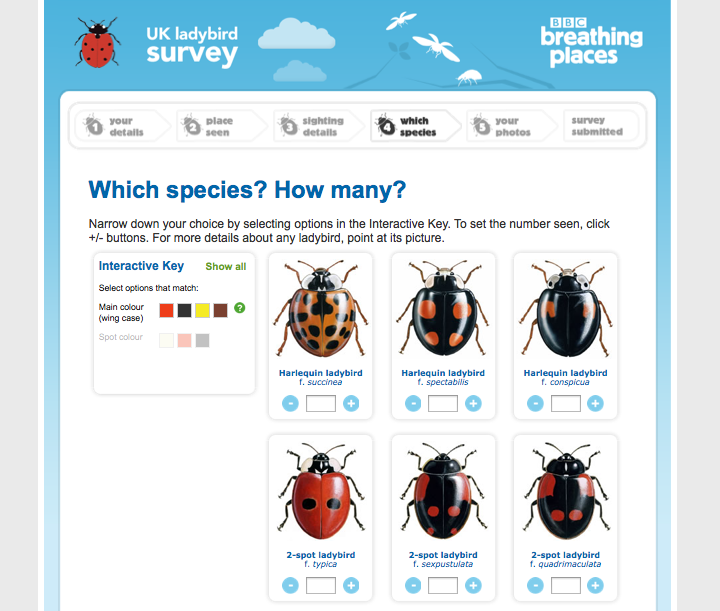
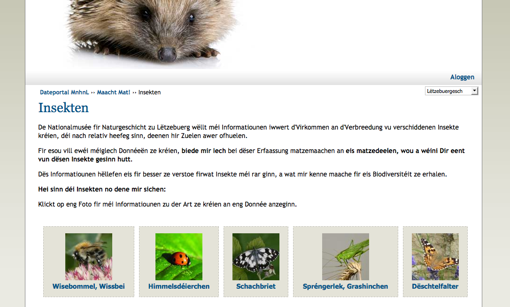
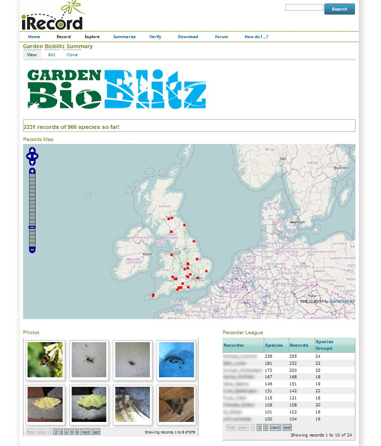
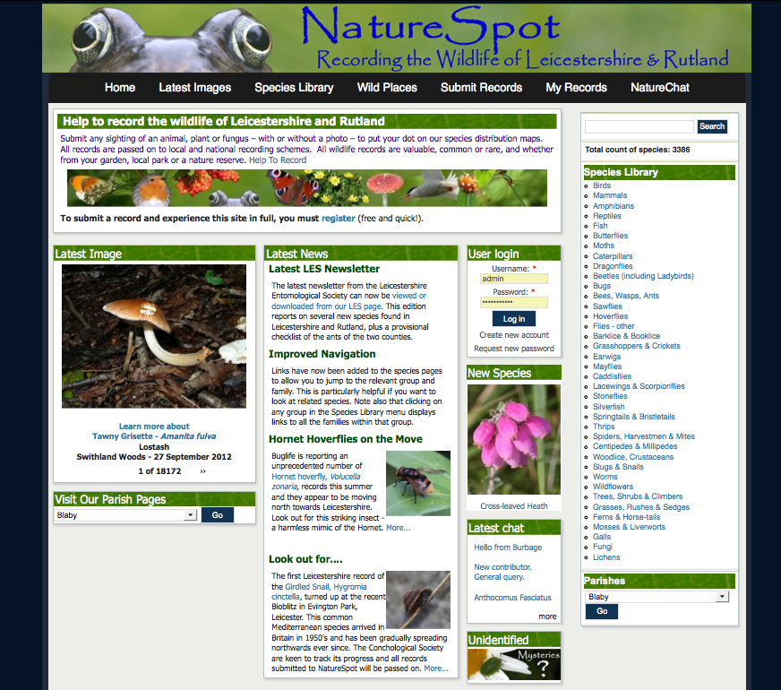
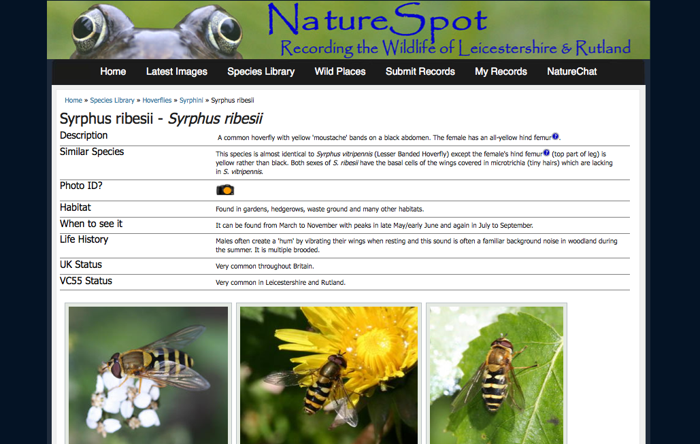
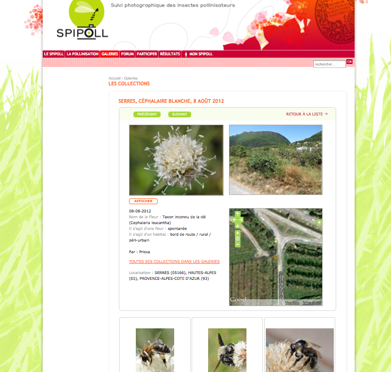

Example sites built using Indicia
#################################

Before going any further, let's take a look at some example usages of Indicia to
see what sort of websites can be built. 

BBC Breathing Places Ladybird Survey
------------------------------------

Firstly, there are sites aimed at engaging the public in biological recording. 
These tend to have simple forms for capturing a species selected from a limited
list of target species, a date and place. Normally the species involved will be
very easily identified, or at least some form of identification assistance is 
provided as in the `BBC Breathing Places Ladybird Survey <http://www.bbc.co.uk/breathingplaces/ladybird-survey>`_:

Despite the fact that this survey was aimed squarely at schools and members of 
the public who may have little identification skills, the assistance provided 
ensures that some useful records are gathered. There is even a sibling ladybird
parasite survey also on the BBC Breathing Places site!

Maach Mat!
----------

Another example of this sort of public participation survey is the 
`Maach Mat (Take Part) survey <http://data.mnhn.lu/en/maach_mat>`_ run by the
*Musée national d'histoire naturelle* in Luxembourg. This survey has a very 
limited list of easily identified species to record in several categories. It's
also a good illustration of the multilingual capabilities of Indicia with the
user interface available in German, French, English and Luxembourgish!

Open Farm Sunday
----------------

All the above surveys capture useful data from the public, though of course it
is possible to run a survey where the sole purpose is public engagement and the
data is not the key focus.

iRecord
-------

`iRecord <http://www.brc.ac.uk/irecord>`_ is a general recording site for the 
United Kingdom, managed and hosted by `BRC <http://www.brc.ac.uk>`_. 

iRecord provides an expert verification portal not only for 
records collected on iRecord itself but any other websites sharing the BRC
Indicia warehouse hosting facilities that opt in via Indicia's data sharing
agreement facilities.

iRecord used Instant Indicia as a starting point for the website build with a 
selection of configured prebuilt forms for both data entry, reporting and 
data management. It makes use of the Easy Login and Forms and Surveys Library
features to synchronise logins across websites and to manage a collection of 
data input forms respectively. As well as allowing recording of miscellaneous 
records, iRecord provides a data entry platform for organisations to host 
surveys on that don't have their own hosting capacity. For example, iRecord is 
being used to host the Garden Bioblitz event which was trialled in 2012 and will
be launched to the public in 2013.

North East Cetacean Project
---------------------------

Orthoptera
----------

British Dragonfly Society
-------------------------

NatureSpot
----------

NatureSpot provides an online recording portal for Leicestershire and Rutland.

At this point in time, over 18,000 photos have been uploaded to NatureSpot of
over 3,300 species. 

NatureSpot is built using Drupal with the Indicia Forms module. Because Drupal
is a fully fledged content management system you can build any site features
you want around the online recording. In this case, NatureSpot features a 
comprehensive library of species accounts for species found in Leicestershire
and Rutland. There are also pages describing the wild places of the area which 
include content and site photos created using Drupal alongside recent records
and record photos from Indicia, using the site's boundary polygon to 
automatically calculate which records to include on the wild place's page.

Biomonitoring Luxembourg
------------------------

National Moth Night
-------------------

Recording Invasive Species Counts
---------------------------------

SPIPOLL
-------

Engaging citizen scientists across France, `SPIPOLL <http://www.spipoll.org>`_ 
involves recording and photographing pollinators visiting flowers and includes 
tight integration into an existing Drupal site, advanced search gallery and a 
highly customised data entry system. 

Rather than capture ad-hoc records, the value of Spipoll data are increased by
following a set methodology which defines the information gathered, time spent
at each flower and method of collecting records. Spipoll also includes 
integration with a Bayesian key to help identify the pollinating insects.