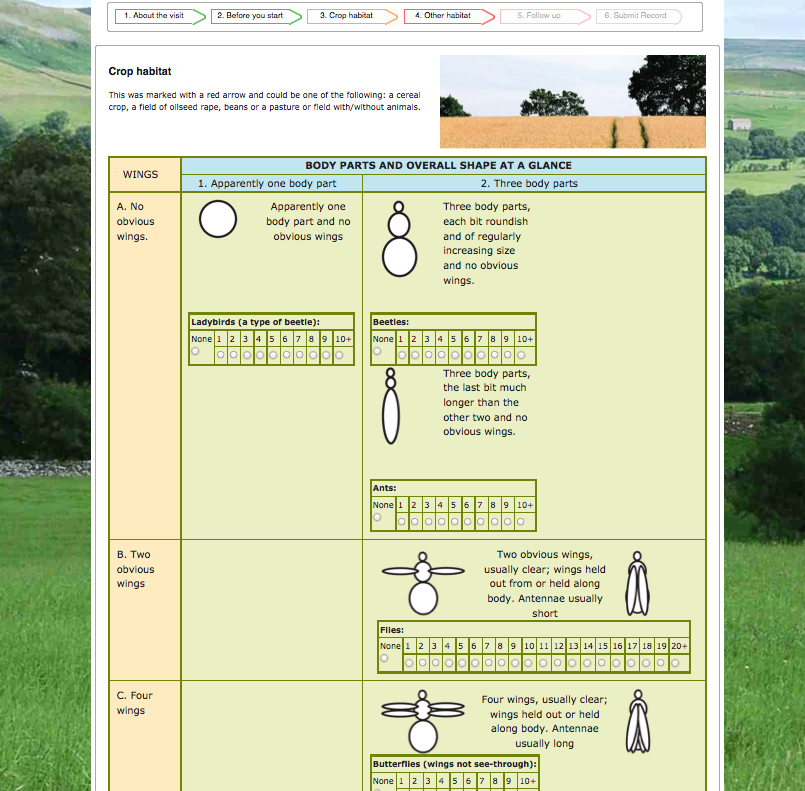
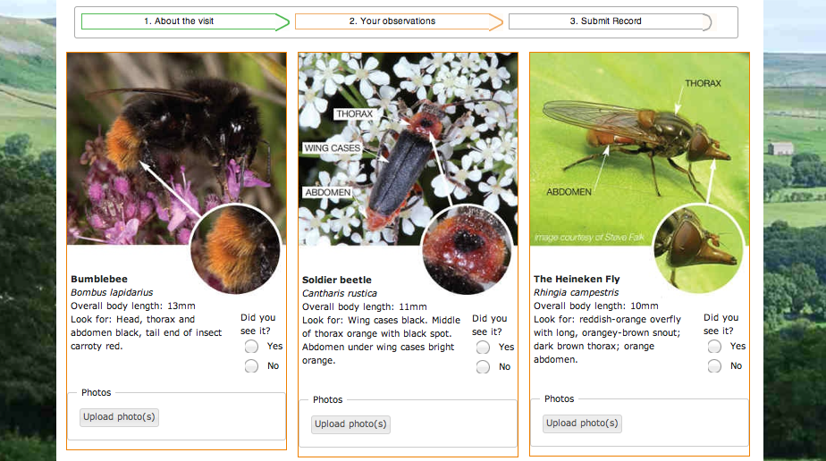
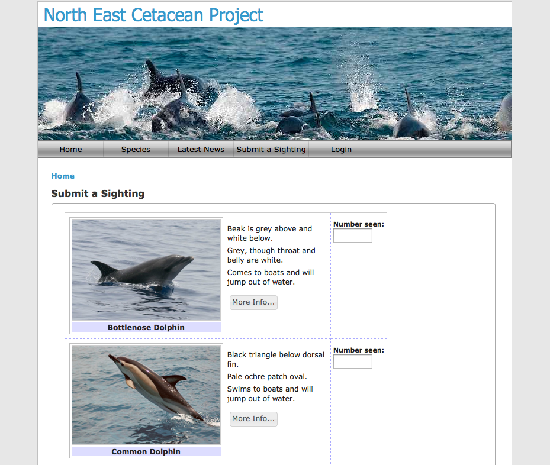

*********************************
Example sites built using Indicia
*********************************

The best way to get a feel for what Indicia can do is to take a look at some 
example websites built using Indicia. This list of sites is not comprehensive
but does give a feel for the range of surveys that can be supported. Firstly, 
we'll look through some examples which are aimed at engaging the public in 
biological recording. These tend to have easy to use forms for capturing a 
species selected from a limited list of target species, a date and place. 
Normally the species involved will be very easily identified, or at least some 
form of identification assistance is provided.

BBC Breathing Places Ladybird Survey
====================================

One example of this type of site is the 
`BBC Breathing Places Ladybird Survey <http://www.bbc.co.uk/breathingplaces/ladybird-survey>`_:

.. image:: ../images/screenshots/websites/bbc-ladybirds-species-picker.png
  :width: 600px
  :alt: Choosing a ladybird species on BBC Breathing Places

Despite the fact that this survey was aimed squarely at schools and members of 
the public who may have little identification skills, the online assistance 
provided ensures that many useful records are gathered. There is even a sibling 
ladybird parasite survey also on the BBC Breathing Places site!

Maach Mat!
==========

Another example of this sort of public participation survey is the 
`Maach Mat (Take Part) survey <http://data.mnhn.lu/en/maach_mat>`_ run by the
*Musée national d'histoire naturelle* in Luxembourg. This survey has a very 
limited list of easily identified species to record in several categories. It's
also a good illustration of the multilingual capabilities of Indicia with the
user interface available in German, French, English and Luxembourgish!

.. image:: ../images/screenshots/websites/maach-mat-species-picker.png
  :width: 600px
  :alt: Selecting a Maach Mat! species to record.

Open Farm Sunday
================

During Open Farm Sunday 2012, farm visitors were offered the chance to 
participate in a survey of potential pollinators or to have a go at a simple 
"Discover Pollinators" checklist. The former was designed in collaboration with 
scientists at the `Centre for Ecology & Hydrology <http://www.ceh.ac.uk>`_ to 
ensure that the resultant data could be used in subsequent analysis despite 
having been collected by unknown members of the public. The survey's results 
have been compared to results collected by trained volunteers during the event 
to provide useful data on the accuracy of citizen science records. The online 
recording forms were designed using Indicia to match the paper forms used in the
field to ensure that the input was as intuitive as possible.

The Discover Pollinators form was intended to provide an opportunity for the 
public to engage with biological recording who had not been involved before. 
Again, the web version of the form was carefully matched to the paper version in
the field to ensure familiarity.

North East Cetacean Project
===========================

`The North East Cetacean Project <http://www.northeastcetaceans.org.uk>`_ was one 
of the first surveys launched using Indicia and collects ad-hoc cetacean 
sigthings in the Northumberland region of England. The data input form includes
identification information for each species to help with record accuracy.

NatureSpot
==========

It's also possible to use Indicia to build recording sites which are aimed at 
enthusiasts, perhaps recording across a much wider taxonomic range or even 
recording any taxon at all. An example of this is the 
`NatureSpot <http://www.naturespot.org.uk>`_ site which allows naturalists in 
Leicestershire and Rutland to record all their sightings and photographs. This 
site supports entry of lists of any species at a particular date and time along
with photo upload, along with online data management and verification facilities.

.. image:: ../images/screenshots/websites/naturespot-home.png
  :width: 600px
  :alt: The NatureSpot home page

At this point in time, over 18,000 photos have been uploaded to NatureSpot of
over 3,300 species. 

.. image:: ../images/screenshots/websites/naturespot-species-account.png
  :width: 600px
  :alt: A species account page from NatureSpot

NatureSpot is built using Drupal with the Indicia Forms module. Because Drupal
is a fully fledged content management system you can build any site features
you want around the online recording. In this case, NatureSpot features a 
comprehensive library of species accounts for species found in Leicestershire
and Rutland. There are also pages describing the wild places of the area which 
include content and site photos created using Drupal alongside recent records
and record photos from Indicia, using the site's boundary polygon to 
automatically calculate which records to include on the wild place's page.

iRecord
=======

`iRecord <http://www.brc.ac.uk/irecord>`_ is a general recording site for the 
United Kingdom, managed and hosted by `BRC <http://www.brc.ac.uk>`_. 

iRecord provides an expert verification portal not only for 
records collected on iRecord itself but any other websites sharing the BRC
Indicia warehouse hosting facilities that opt in via Indicia's data sharing
agreement facilities.

iRecord used Instant Indicia as a starting point for the website build with a 
selection of configured prebuilt forms for both data entry, reporting and 
data management. It makes use of the Easy Login and Forms and Surveys Library
features to synchronise logins across websites and to manage a collection of 
data input forms respectively. As well as allowing recording of miscellaneous 
records, iRecord provides a data entry platform for organisations to host 
surveys on that don't have their own hosting capacity. For example, iRecord is 
being used to host the Garden Bioblitz event which was trialled in 2012 and will
be launched to the public in 2013.

.. image:: ../images/screenshots/websites/irecord-gbb-survey-summary.jpg
  :width: 600px
  :alt: Summary of the Garden Biolitz results.

SPIPOLL
=======

Engaging citizen scientists across France, `SPIPOLL <http://www.spipoll.org>`_ 
involves recording and photographing pollinators visiting flowers and includes 
tight integration into an existing Drupal site, advanced search gallery and a 
highly customised data entry system. 

.. image:: ../images/screenshots/websites/spipoll-collection.png
  :width: 600px
  :alt: The results of a flower survey performed for Spipoll

Rather than capture ad-hoc records, the value of Spipoll data are increased by
following a set methodology which defines the information gathered, time spent
at each flower and method of collecting records. Spipoll also includes 
integration with a Bayesian key to help identify the pollinating insects.

Biomonitoring Luxembourg
========================

As well as these generic recording solutions, it is also possible to use 
Indicia to develop highly specialised forms matched to particular survey 
methodologies, such as this form for long term grid based monitoring of 
butterflies in Luxembourg:

.. todo:: 

  image

Developing specialist solutions such as this does require some code to be 
written, but they are much easier to develop using the Indicia toolkit as a 
starting point than if you started from scratch.