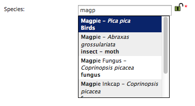
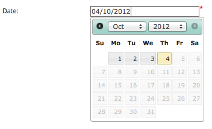
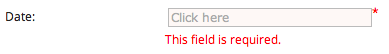
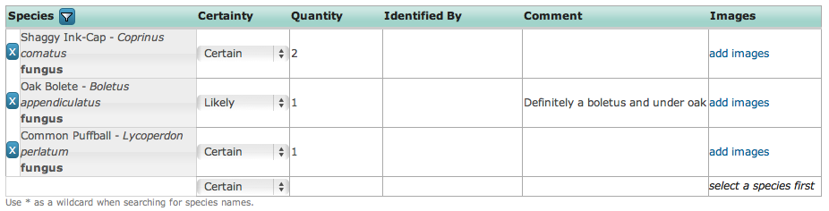
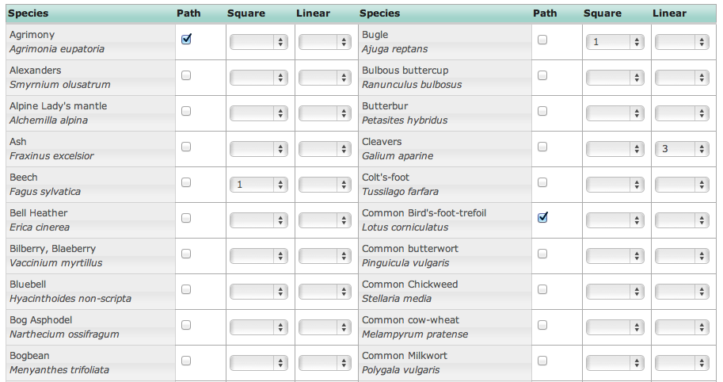
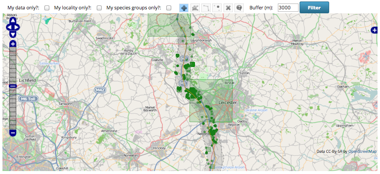
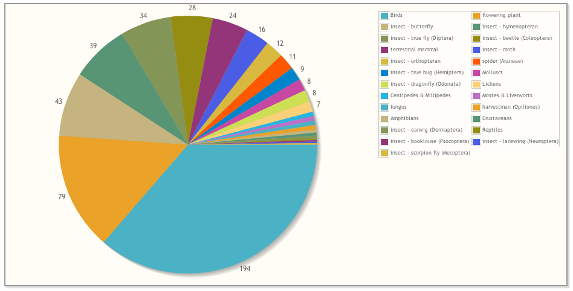

******
Taster
******

Ok, we know that Indicia is about building online biological recording websites
using a suite of tools services and components. But what sorts of things might 
I expect to get? This section illustrates just a few examples but don't forget 
that Indicia is open source and fully extensible so you can create your own 
controls and other facilities for just the extra bits you need if you have 
access to a programmer.

Data entry
==========

Inputting a species in Indicia can be via a variety of techniques including
picking from drop-down selection boxes, checkboxes or inputting into a text
box. For the latter it is commonplace to provide a drop-down list of possible
selections.

Note that the recorder is informed of the species group they are picking from
as well as the preferred name of the species, so the chances of mistakes when
selecting "dangerous names" are drastically reduced. The species search is also
clever enough to tolerate differences in punctuation or spacing in the names, 
e.g. is it a 7-spot or a 7 spot ladybird? The species autocomplete control in 
this screenshot has a handy lock icon after it which holds the value
for the next time you use this input form - very useful if inputting a list
of sightings of a single species at different places or on a single date. The 
lock option can of course be configured to be available for any control you 
feel it is appropriate for (the date or grid reference are both good examples).

Entering other types of information about each record is supported through a 
library of controls. Here the date picker ensures that the recorder always
inputs a valid date, though of course it is configurable to allow vague date
entry if you prefer. 352px

When you use an Indicia provided data input control you get a range of 
functionality options straight out of the box that you would otherwise have to 
configure for yourself. These include:

* Saving the value to the database is handled for you
* Loading the value back from the database for editing is handled for you
* The ability to lock the value so it is remembered next time you use the form
* Validation rules are applied to the control and messages displayed to the user 
  as approriate

As an example of the latter, here's the above date_picker control having tried
to save the record without filling it in:

Species entry in Indicia can be via any method that is appropriate to the survey, 
but in many cases when entry of multiple records is required the species 
checklist control can be configured to allow appropriate and rapid data entry 
that suits the survey's needs. Here the grid is configured to allow basic record
data but the attributes available for input in the grid can be configured as 
appropriate to the survey methodology and/or species group being recorded.

The species_checklist grid control is highly configurable, for example it can 
be configured to allow ticking off of species from a preset list rather than 
to input an arbitrary list of species. In this instance recorders tick off 
species against a preset list of wildflowers and can specify which part of the
survey plot the species was found on.

The grid also allows upload of photos for each record. Resizing of images is 
handled from within the browser meaning that photo upload times are drastically 
reduced, making it feasible to upload substantial lists of records and photos 
into Indicia based online recording forms.

.. image:: ../images/screenshots/websites/irecord-species-grid.png
  :width: 600px
  :alt: Inputting a list of records and photos

Entering a grid reference for the records via a click on a map ensures that 
transcription errors in grid references are a thing of the past.

.. image:: ../images/controls/map_picker.jpg
  :width: 600px
  :alt: Selecting the grid square for the records

Grid references can of course be input directly into the text box when 
available. Rather than force all records to be linked to a site even for ad-hoc
records, the link between a record and a site is optional in Indicia and 
every record has its own unique grid reference, reducing the chance that a 
record will be mistakenly recorded at the centre point of the site.

.. todo::

  BDS showing species identification notes

Reporting
=========

Many Indicia reporting requirements are met by the flexible report grid control
which is designed to output tabular data and supports filtering and sorting out
of the box. Here the grid has been configured to include thumbnails of the 
photos associated with each record.

.. image:: ../images/screenshots/websites/irecord-grid-thumbnails.png
  :width: 600px
  :alt: Grid including thumbnails of the record photos

Clicking on a photo thumbnail in any grid zooms the photo for a closer look.

.. image:: ../images/screenshots/websites/irecord-photo-lightbox.png
  :width: 600px
  :alt: Zoomed in photo of *Bombus pascuorum*

The report grid control is flexible enough to be reconfigured as a photo
gallery, here showing a simple parameters form for selection of the date range
and/or species group to show photos for.

.. image:: ../images/screenshots/websites/irecord-photo-gallery.png
  :width: 600px
  :alt: Photo gallery

Indicia's reporting capabilities also allow you to output report data onto maps
or charts. The following map shows a buffered report for records in a 3km zone 
around the M1 corridor, with records shown at their original precision including
a couple of rather imprecise 10km records:

Maps can show aggregated information as well as simple records. Here a layer of
British vice counties is combined with the records data to produce a density map
of species on iRecord. Obviously this is more reflective of recording effort at
this stage rather than any real indication of species diversity.

.. image:: ../images/screenshots/websites/irecord-species-density-map.png
  :width: 600px
  :alt: The iRecord summary report for species density.

Charting with line, bar and pie charts is also supported for any suitable report
data. The following pie chart shows the species groups I've been recording this 
year with the pie size indicating the number of species for each group.

Indicia allows synchronisation of the data between multiple reports, charts or 
maps on a single page. For example you can build a page showing a map of records
along with a table showing the distinct species and a pie chart of a breakdown
by species group on a single page. Here the Map Explorer prebuilt form combines
a map with a simple table of the records shown on the map. The grid can be 
filtered and sorted with the changes kept in synch with the map display. This
example is from the iRecord Explore facility.

.. image:: ../images/screenshots/websites/irecord-explore.png
  :width: 600px
  :alt: The iRecord Explore page.

Data Management
===============

.. todo::

  Fill in the data management section, e.g. a couple of warehouse screen shots

Web-Services
============

.. todo::

  Fill in the web services section